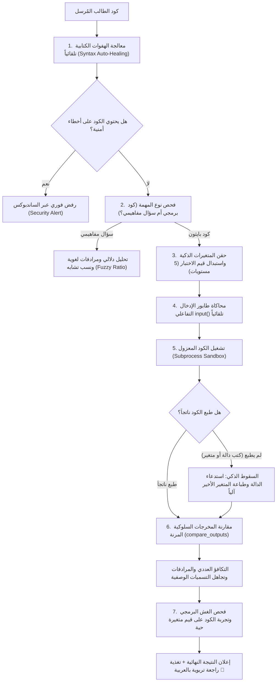
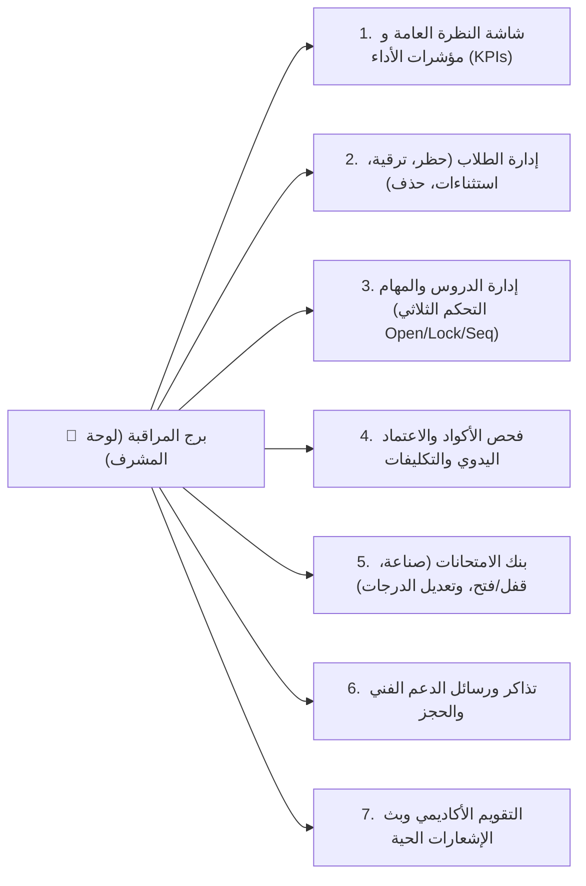

# 👑 الموسوعة الشاملة والتوثيق المرجعي الكامل لمشروع: منصة مسار إتقان بايثون (Python Mastery Platform) 🐍
> **توثيق هندسي مرجعي متكامل من الألف إلى الياء (From A to Z)**  
> **إعداد وتوثيق لـ:** البشمهندس محمد الصفتي / البشمهندس يوسف الصفتي  
> **المستودع البرمجي:** [`youssef-elsafty/platform-python`](https://github.com/youssef-elsafty/platform-python)  
> **الإصدار:** الإصدار الخامس المؤمن (Phase 5 Enterprise Secured - Production-Ready)

---

## 📑 فهرس المحتويات العام (Table of Contents)

1. [المقدمة والرؤية الهندسية للمشروع (Project Vision & Executive Summary)](#1-المقدمة-والرؤية-الهندسية-للمشروع)
2. [الهيكل المعماري للمشروع وشجرة الملفات بالتفصيل (Directory Tree & Architecture)](#2-الهيكل-المعماري-للمشروع-وشجرة-الملفات-بالتفصيل)
3. [الهندسة الكاملة لقاعدة البيانات (Complete Database Architecture & Schemas)](#3-الهندسة-الكاملة-لقاعدة-البيانات)
   - [3.1 المعمارية الثنائية (PostgreSQL + SQLite Fallback)](#31-المعمارية-الثنائية)
   - [3.2 نظام الهجرات التلقائي (Database Migrations 001 - 008)](#32-نظام-الهجرات-التلقائي)
   - [3.3 التشريح الدقيق لكافة الجداول والقيود والمفاتيح الأجنبية](#33-التشريح-الدقيق-لكافة-الجداول)
   - [3.4 توثيق كافة دوال التفاعل مع قاعدة البيانات في `db.py`](#34-توثيق-كافة-دوال-التفاعل-مع-قاعدة-البيانات)
4. [محرك التقييم والتصحيح السلوكي الذكي (The Brain - `engine.py`)](#4-محرك-التقييم-والتصحيح-السلوكي-الذكي)
   - [4.1 معالجة الهفوات النحوية تلقائياً (Syntax Auto-Healing)](#41-معالجة-الهفوات-النحوية-تلقائيا)
   - [4.2 استعادة كود الأسطر المضغوطة (Collapsed Code Normalization)](#42-استعادة-كود-الأسطر-المضغوطة)
   - [4.3 خوارزمية حقن واستبدال المتغيرات الذكية (Variable Overrides Engine)](#43-خوارزمية-حقن-واستبدال-المتغيرات-الذكية)
   - [4.4 محاكاة وحقن طابور دالة الإدخال `input()`](#44-محاكاة-وحقن-طابور-دالة-الإدخال-input)
   - [4.5 آليات السقوط الذكي والتعرف على النواتج دون طباعة (Smart Fallbacks)](#45-آليات-السقوط-الذكي-والتعرف-على-النواتج)
   - [4.6 خوارزميات المقارنة المرنة والدلالية (`compare_outputs`)](#46-خوارزميات-المقارنة-المرنة-والدلالية)
   - [4.7 التصحيح السلوكي للمهام المفتوحة دون مودل مقيد (Model-Free Tasks)](#47-التصحيح-السلوكي-للمهام-المفتوحة)
   - [4.8 مترجم الأخطاء البرمجية إلى إرشادات تربوية عربية](#48-مترجم-الأخطاء-البرمجية-إلى-إرشادات-تربوية)
5. [منظومة العزل الأمني وبيئة الساندبوكس (Security Sandbox - `runner.py` & Microservices)](#5-منظومة-العزل-الأمني-وبيئة-الساندبوكس)
   - [5.1 تحليل الشجرة المجردة للكود (AST Safety Visitor)](#51-تحليل-الشجرة-المجردة-للكود)
   - [5.2 القوائم السوداء الصارمة (المكتبات، الدوال، الخصائص الخفية)](#52-القوائم-السوداء-الصارمة)
   - [5.3 العزل المحلي المشدد عبر Subprocess وأعلام بايثون](#53-العزل-المحلي-المشدد)
   - [5.4 ساندبوكس حاويات دوكر للإنتاج (`runner_service` & `sandbox`)](#54-ساندبوكس-حاويات-دوكر-للإنتاج)
6. [طبقة الحماية والتشفير والتحقق (Security Middleware - `security.py`)](#6-طبقة-الحماية-والتشفير-والتحقق)
   - [6.1 تشفير وتجزئة كلمات المرور (PBKDF2-HMAC-SHA256)](#61-تشفير-وتجزئة-كلمات-المرور)
   - [6.2 معدل الحد من الطلبات ذو النافذة المنزلقة (Sliding Window Rate Limiter)](#62-معدل-الحد-من-الطلبات)
   - [6.3 حماية الجلسات والرموز المانعة لتزوير الطلبات (CSRF Protection)](#63-حماية-الجلسات-والرموز-csrf)
   - [6.4 ترويسات الأمان الصارمة والتحقق بالمدخلات](#64-ترويسات-الأمان-الصارمة)
7. [خوادم الويب وتوجيه المسارات والـ API الكامل (Web Servers & API Reference)](#7-خوادم-الويب-وتوجيه-المسارات)
   - [7.1 معمارية الخادم `app.py` بدون أي أطر عمل خارجية](#71-معمارية-الخادم-apppy)
   - [7.2 التوثيق المرجعي الشامل لكافة نقاط الـ API (GET, POST, DELETE)](#72-التوثيق-المرجعي-الشامل-لكافة-نقاط-api)
   - [7.3 نظام رفع الملفات والتكليفات واستخراج كود جوبيتر نوت بوك](#73-نظام-رفع-الملفات-واستخراج-كود-جوبيتر)
   - [7.4 مساعد الذكاء الاصطناعي التفاعلي المدمج للطلاب](#74-مساعد-الذكاء-الاصطناعي-التفاعلي)
8. [برج المراقبة ولوحة تحكم المشرف (Admin Control Tower - `admin_app.py`)](#8-برج-المراقبة-ولوحة-تحكم-المشرف)
   - [8.1 الأقسام السبعة للوحة المشرف ووظائفها الحية](#81-الأقسام-السبعة-للوحة-المشرف)
   - [8.2 نظام التحكم ثلاثي الحالات للدروس والمهام (Open / Lock / Sequential)](#82-نظام-التحكم-ثلاثي-الحالات)
   - [8.3 منظومة الاستثناءات الفردية للطلاب (Per-User Task Overrides)](#83-منظومة-الاستثناءات-الفردية-للطلاب)
   - [8.4 خاصية الاعتماد اليدوي لحلول الطلاب ومحرر الدرجات](#84-خاصية-الاعتماد-اليدوي-لحلول-الطلاب)
9. [هيكلية المنهج ومسارات الدروس (Curriculum & Lessons System)](#9-هيكلية-المنهج-ومسارات-الدروس)
   - [9.1 المسار العام مقابل المسار الجامعي](#91-المسار-العام-مقابل-المسار-الجامعي)
   - [9.2 مواصفات ملف الـ JSON القياسي للدروس والمهام](#92-مواصفات-ملف-json-القياسي)
   - [9.3 تصنيف المهام: تمارين مباشرة مقابل مراجعات تراكمية](#93-تصنيف-المهام)
10. [واجهة المستخدم ونظام التصميم ثلاثي الأبعاد (Frontend & 3D Gamification)](#10-واجهة-المستخدم-ونظام-التصميم)
    - [10.1 فلسفة التصميم التفاعلي المجسم (Duolingo Style)](#101-فلسفة-التصميم-التفاعلي)
    - [10.2 نظام الألوان المزدوج (Light / Dark Mode)](#102-نظام-الألوان-المزدوج)
    - [10.3 محرر الأكواد وشاشة التيرمينال التفاعلية](#103-محرر-الأكواد-وشاشة-التيرمينال)
11. [دليل التشغيل والنشر وضمان الجودة (DevOps & Testing Guide)](#11-دليل-التشغيل-والنشر-وضمان-الجودة)
    - [11.1 تشغيل المشروع محلياً بكافة خوادمه](#111-تشغيل-المشروع-محليا)
    - [11.2 حزم الاختبارات الآلية وضمان الجودة (Automated Test Suites)](#112-حزم-الاختبارات-الآلية)
    - [11.3 النشر السحابي (Docker, Render, Heroku) ومتغيرات البيئة](#113-النشر-السحابي)

---

# 1. المقدمة والرؤية الهندسية للمشروع

### 1.1 ما هي منصة مسار إتقان بايثون؟
**منصة مسار إتقان بايثون (Python Mastery Platform)** هي منصة برمجية تفاعلية متكاملة، صُممت وبُنيت من الصفر لتعليم واختبار مهارات لغة بايثون للطلاب في مختلف المراحل التعليمية (بما فيها الثانوية العامة، البكالوريا، والمستويات الجامعية المتقدمة).

### 1.2 المشكلة الكبرى في منصات التعليم التقليدية
في كافة منصات التعليم البرمجي الشائعة (مثل منصات الاختبارات المؤتمتة القديمة):
- يتم تقييم كود الطالب عبر "المطابقة الحرفية" مع مودل إجابة ثابت (Rigid String Matching).
- إذا قام الطالب بحل المسألة بطريقة صحيحة هندسياً ولكن:
  - استخدم دالة الإدخال التفاعلي `input()` بدلاً من تثبيت قيمة المتغير.
  - غيّر اسم المتغير (مثلاً سمّاه `grade` بدلاً من `score`).
  - قام بتعريف دالة `def` واستدعائها بدلاً من كتابة كود مسطح.
  - كتب جملة توضيحية أثناء الطباعة مثل: `print("Result is: 85")` بدلاً من `print(85)`.
  - نسى إغلاق القوس الأخير لهفوة بسيطة أو وضع مسافة بالخطأ في مقارنة مثل `> =`.
- **النتيجة في المنصات العادية:** يرفض النظام حل الطالب بالكامل ويعتبره راسباً! مما يتسبب في إحباط الطالب وقتل شغف الابتكار البرمجي.

### 1.3 الحل الهندسي الثوري في هذه المنصة
تم ابتكار وبناء **محرك تقييم سلوكي ذكي وحر (Model-Free Smart Behavioral Evaluator)** في الملف [`engine.py`](file:///c:/Users/France%20Tech/Desktop/learning%20a%20python%20by%20a%20websit/engine.py):
1. **يقبل أي طريقة حل برمجية صحيحة:** أياً كانت أسماء المتغيرات، الدوال، أو قيم الاختبار الابتدائية.
2. **محاكاة دالة `input()` تلقائياً:** حقن طابور قيم ديناميكي يغذي مدخلات الطالب دون تعليق البرنامج.
3. **معالجة الهفوات الكتابية البسيطة (Auto-Healing):** تصحيح الأقواس المفتوحة، وتعديل عوامل المقارنة، واستعادة المسافات البادئة للأكواد المنسوخة تلقائياً.
4. **المرونة الدلالية التامة:** قبول المرادفات اللغوية (`Pass` = `Passed` = `ناجح`)، والتكافؤ العددي (`84.0` = `84`)، وتجاوز التسميات الوصفية.
5. **دعم المهام المفتوحة بدون مودل (Model-Free Open Tasks):** يستطيع المشرف إنشاء مهام وتكليفات بدون كتابة أي كود حل نموذجي، حيث يحلل المحرك المطلوب ويفحص منطق كود الطالب عبر توليد قيم اختبارية متعددة والتأكد من فاعلية التفرعات الشرطية وحسابات الكود.

### 1.4 الفلسفة المعمارية: الاعتماد الصفري على المكتبات الخارجية (Zero Dependencies)
تم بناء النواة البرمجية بالكامل باستخدام **مكتبات بايثون القياسية (Python Standard Library)** حصراً دون إقحام أي إطار عمل خارجي ثقيل (مثل Django أو Flask أو FastAPI)؛ وذلك لتحقيق:
- سرعة إقلاع واستجابة فائقة (Sub-millisecond latency).
- أمان فائق ضد الثغرات الأمنية في المكتبات التابعة (Supply-chain attacks).
- سهولة تامة في النشر والتشغيل على أي سيرفر أو حاوية بدون تعقيدات التثبيت.

---

# 2. الهيكل المعماري للمشروع وشجرة الملفات بالتفصيل

```text
learning-python-platform/
│
├── app.py                      # السيرفر الرئيسي للإنتاج ومعالجة طلبات الطلاب والـ API (Port 8008)
├── admin_app.py                # سيرفر لوحة تحكم المشرف وبرج المراقبة المستقل (Port 8009)
├── engine.py                   # عقل المنصة: محرك التصحيح السلوكي الذكي وتحليل المنطق والـ AST
├── runner.py                   # الساندبوكس: فحص الأمان ومحرك العزل وتشغيل الكود المحمي
├── db.py                       # طبقة قاعدة البيانات الشاملة: تدعم PostgreSQL محلياً وسحابياً مع SQLite Fallback
├── security.py                 # طبقة التشفير والحماية: تشفير كلمات المرور، معدل الطلبات، ورموز CSRF
│
├── progress.db                 # ملف قاعدة بيانات SQLite المحلية الفعلي (تخزين فوري محلي)
├── Procfile                    # ملف تعريف خدمة التشغيل على المنصات السحابية (Render / Heroku)
├── render.yaml                 # مواصفات نشر السيرفر والخدمات السحابية على منصة Render
├── Dockerfile                  # ملف بناء حاوية المنصة الرئيسية
├── docker-compose.yml          # ربط حاوية التطبيق بحاوية خدمة الساندبوكس وقاعدة البيانات
├── requirements.txt            # المكتبات الإضافية الاختيارية (psycopg2-binary للاتصال بـ PostgreSQL)
│
├── lessons/                    # مستودع الدروس والتحديات والمقررات (ملفات JSON)
│   ├── 01_intro_print.json     # الدرس 1: المدخل إلى بايثون ودوال الطباعة
│   ├── 02_variables.json       # الدرس 2: المتغيرات وأنواع البيانات والعمليات
│   ├── 03_conditionals.json    # الدرس 3: الجمل الشرطية والمنطق البرمجي
│   ├── custom_*.json           # الدروس المضافة ديناميكياً بواسطة المشرف من لوحة التحكم
│   ├── uni_01_datastructures.json  # مسار الجامعة 1: هياكل البيانات والقوائم والقواميس
│   ├── uni_02_oop.json             # مسار الجامعة 2: البرمجة كائنية التوجه (OOP & Classes)
│   └── uni_03_brain_challenge.json # مسار الجامعة 3: تحديات خوارزمية ذكية متقدمة
│
├── migrations/                 # ملفات ترقية وهندسة قاعدة البيانات (SQL Migrations)
│   ├── 001_initial_schema.sql  # المخطط التأسيسي للجداول والمؤشرات
│   ├── 002_admin_and_logs.sql  # جداول المشرف وسجلات الدخول
│   ├── 003_contact_inquiries.sql # جداول رسائل التواصل والدعم
│   ├── 004_task_submissions.sql  # جداول تفاصيل تسليمات الأكواد والملفات
│   ├── 005_task_duration.sql   # إضافة حقول زمن الحل وحالة تنشيط الحساب
│   ├── 006_exams.sql           # منظومة بنك الامتحانات والتسليمات والدرجات
│   ├── 007_user_saved_code_and_task_controls.sql # مسودات الطلاب والتحكم بحالات المهام
│   └── 008_admin_dashboard_features.sql # التقويم، الإشعارات، والاستثناءات الفردية
│
├── templates/                  # واجهات المستخدم التفاعلية (HTML5 / Vanilla JS)
│   ├── index.html              # منصة الطالب الكاملة (الدروس، المحرر، الامتحانات، التكليفات، المساعد الذكي)
│   └── admin.html              # لوحة المشرف وبرج المراقبة الإداري والتحكم الشامل
│
├── static/                     # الأصول الثابتة
│   ├── css/
│   │   └── style.css           # ملف التنسيق الرئيسي: نظام الألوان، التصميم ثلاثي الأبعاد، ودعم الموبايل
│   └── js/                     # التفاعلات الحركية والربط البرمجي
│
├── runner_service/             # خدمة ميكروسيرفيس لتنفيذ الأكواد في بيئة دوكر معزولة
│   ├── Dockerfile              # بناء صورة الميكروسيرفيس
│   └── server.py               # خادم استقبال الأكواد وتشغيلها داخل حاوية الساندبوكس
│
├── sandbox/                    # حاوية الساندبوكس المعزولة كلياً عن الشبكة والنظام
│   └── Dockerfile              # صورة بايثون الخفيفة المعزولة والمجردة من أي صلاحيات
│
├── uploads/                    # مستودع حفظ الملفات والتكليفات المرفوعة من الطلاب
│   └── submissions/            # ملفات بايثون (.py)، دفاتر جوبيتر (.ipynb)، والملفات المضغوطة (.zip)
│
├── tests/ (أو test_*.py)        # منظومة الاختبارات الآلية الشاملة
│   ├── test_platform.py        # فحص كفاءة المحرك الذكي، التسلسل التدريجي، والتقييم
│   ├── test_sandbox.py         # فحص أمان الساندبوكس وحظر الثغرات
│   ├── test_exams.py           # فحص دورة حياة الامتحانات وتصحيحها وحفظ الدرجات
│   ├── test_users.py           # فحص تسجيل الطلاب وتشفير كلمات المرور واستقلالية الجلسات
│   ├── test_persistence_and_controls.py # فحص مفاتيح التحكم الإداري وحفظ المسودات
│   ├── test_ai_and_notifications.py     # فحص الشات بوت الذكي وتنبيهات الطلاب
│   └── test_api_security.py    # فحص معدل الطلبات وحماية CSRF وترويسات الأمان
│
├── محمد الصفتي.md             # هذا الملف: المرجع الشامل والأكبر للمشروع بالتفصيل الممل
├── elsafty.md / elsafty        # وثائق المشروع والموجز الهندسي السابق
├── PROJECT_OVERVIEW.md         # سجل إنجازات وتطوير المشروع مرحلة بمرحلة
└── HOW_TO_ADD_LESSONS.md       # دليل تدريبي للمشرف لكيفية كتابة ونشر دروس جديدة
```

---

# 3. الهندسة الكاملة لقاعدة البيانات

قاعدة البيانات في هذا المشروع تم تصميمها لتكون **صناعية ومرنة بنسبة 100% (Enterprise & Resilient)**؛ بحيث تعمل على بيئات التطوير المحلية دون الحاجة لتثبيت أي برامج، وتعمل في الوقت نفسه على أضخم بيئات الإنتاج السحابية بسلاسة متناهية.

### 3.1 المعمارية الثنائية (PostgreSQL + SQLite Fallback)
داخل الملف [`db.py`](file:///c:/Users/France%20Tech/Desktop/learning%20a%20python%20by%20a%20websit/db.py):
- **في بيئة الإنتاج السحابي (Production):**
  عند توفر متغير البيئة `DATABASE_URL` (سواء من Render أو Supabase أو Railway أو AWS RDS):
  - يقوم المحرك بتحويل بروتوكول `postgres://` القديم إلى `postgresql://` تلقائياً لتوافق مكتبة `psycopg2`.
  - يتم تفعيل **حوض اتصالات مسبق التجهيز (Connection Pool)** عبر `psycopg2.pool.SimpleConnectionPool(1, 20, DATABASE_URL)`. هذا يحمي السيرفر من استنزاف الاتصالات ويسمح باستقبال آلاف الطلبات المتزامنة بأعلى أداء.
  - جميع الاستعلامات يتم تحويل معالمها (Parameterized Placeholders) من `?` إلى `%s` ديناميكياً في دالة `execute()`.
- **في بيئة التطوير المحلي (Local Development):**
  في حال غياب متغير `DATABASE_URL` أو تعذر الاتصال بـ PostgreSQL:
  - يقوم النظام تلقائياً بالتحول الصامت والفوري (Seamless Fallback) إلى ملف SQLite المحلي باسم `progress.db`.
  - يتم فتح الاتصال مع تفعيل مهلة زمنية `timeout=20.0s`، وتعيين `conn.row_factory = sqlite3.Row` لضمان إرجاع النتائج على شكل قواميس (Dictionaries) مطابقة تماماً لمخرجات PostgreSQL `RealDictCursor`.
  - كل اتصال يستخدم الـ `Context Manager` (`__enter__` و `__exit__`)؛ مما يضمن تطبيق العمليات البرمجية بحزم: تنفيذ `commit()` في حال النجاح، وتنفيذ `rollback()` فوري عند حدوث أي خطأ، وإعادة الاتصال للحوض أو إغلاقه بأمان.

---

### 3.2 نظام الهجرات التلقائي (Database Migrations 001 - 008)
عند استدعاء دالة `init_db()` أثناء إقلاع الخادم:
1. إذا كان المتصل قاعدة بيانات **PostgreSQL**:
   يقوم المحرك بقراءة وتنفيذ ملفات الـ SQL الموجودة في المجلد `migrations/` بالتسلسل الرقمي التالي:
   - `001_initial_schema.sql`: بناء جداول المستخدمين، الجلسات، الدروس، والمهام المكتملة والمؤشرات (Indexes).
   - `002_admin_and_logs.sql`: بناء جدول سجلات تسجيل الدخول وتتبع عناوين الـ IP.
   - `003_contact_inquiries.sql`: جدول استفسارات ورسائل الدعم الفني.
   - `004_task_submissions.sql`: جدول تسجيل تفاصيل الأكواد البرمجية وتسليمات الطلاب.
   - `005_task_duration.sql`: إضافة أعمدة قياس سرعة الحل بالثواني (`duration_seconds`) وحظر المستخدمين (`is_active`).
   - `006_exams.sql`: منظومة بنك الامتحانات، الأسئلة، وتسليمات الطلاب وتصحيحها.
   - `007_user_saved_code_and_task_controls.sql`: جداول الحفظ التلقائي لمسودات الطلاب والتحكم المركزي بحالات المهام.
   - `008_admin_dashboard_features.sql`: جداول التقويم الدراسي، الإشعارات، وجدول استثناءات الطلاب.
2. إذا كان المتصل **SQLite**:
   يقوم المحرك بتنفيذ أوامر `CREATE TABLE IF NOT EXISTS` المطابقة تماماً لكافة الجداول الـ 15، مع استدعاء استعلامات التحقق عبر `PRAGMA table_info` لإضافة أي أعمدة مستحدثة بأمان دون فقدان أي بيانات موجودة مسبقاً.
3. **إنشاء حساب المشرف الافتراضي تلقائياً:**
   يتحقق المحرك من وجود حساب المشرف الرئيسي؛ وإذا لم يكن موجوداً، يقوم بإنشائه تلقائياً بالبيانات:
   - اسم المستخدم: `youssef`
   - البريد الإلكتروني: `admin@pythonmastery.com`
   - كلمة المرور المشفرة: `admin123` (تُخزن مشفرة عبر خوارزمية PBKDF2)
   - الرتبة: `admin`

---

### 3.3 التشريح الدقيق لكافة الجداول والقيود والمفاتيح الأجنبية

#### 1. جدول المستخدمين (`users`)
المستودع الرئيسي لحسابات الطلاب والمشرفين:
| اسم الحقل | نوع البيانات | القيود والملاحظات | الوظيفة |
| :--- | :--- | :--- | :--- |
| `id` | TEXT | PRIMARY KEY | المعرف الفريد للمستخدم (UUID v4) |
| `username` | TEXT | UNIQUE, NOT NULL | اسم المستخدم للدخول (بين 3 و 30 حرفاً) |
| `email` | TEXT | UNIQUE, NOT NULL | البريد الإلكتروني للطالب (مكتوب بحروف صغيرة) |
| `password_hash` | TEXT | NOT NULL | كلمة المرور المشفرة بصيغة `salt:key_hex` |
| `role` | TEXT | DEFAULT 'student' | رتبة الحساب: `student` (طالب) أو `admin` (مشرف) |
| `is_active` | BOOLEAN | DEFAULT 1 | حالة الحساب: `1` مفعل، `0` محظور من دخول المنصة |
| `created_at` | TIMESTAMP | DEFAULT CURRENT_TIMESTAMP | تاريخ ووقت إنشاء الحساب |

#### 2. جدول الجلسات المشفرة (`sessions`)
إدارة جلسات المصادقة الآمنة وحمايتها من الاختراق:
| اسم الحقل | نوع البيانات | القيود والملاحظات | الوظيفة |
| :--- | :--- | :--- | :--- |
| `session_token` | TEXT | PRIMARY KEY | رمز الجلسة الآمن (64 حرفاً مشفراً تم توليده عبر `secrets`) |
| `user_id` | TEXT | NOT NULL, FK to `users(id)` ON DELETE CASCADE | معرف الطالب صاحب الجلسة |
| `created_at` | TIMESTAMP | DEFAULT CURRENT_TIMESTAMP | توقيت بدء الجلسة |

#### 3. جدول سجلات الدخول والأمان (`login_logs`)
برج مراقبة محاولات الدخول لتتبع نشاط الطلاب وكشف أي دخول مريب:
| اسم الحقل | نوع البيانات | القيود والملاحظات | الوظيفة |
| :--- | :--- | :--- | :--- |
| `id` | TEXT | PRIMARY KEY | معرف سجل الدخول (UUID v4) |
| `user_id` | TEXT | NOT NULL | معرف المستخدم الذي سجل دخوله |
| `username` | TEXT | NOT NULL | اسم المستخدم أثناء الدخول |
| `ip_address` | TEXT | NULLABLE | عنوان الـ IP الفعلي للطالب (يدعم X-Forwarded-For) |
| `login_time` | TIMESTAMP | DEFAULT CURRENT_TIMESTAMP | توقيت تسجيل الدخول الدقيق |

#### 4. جدول المهام المكتملة (`completed_tasks`)
سجل إنجازات الطلاب التراكمي لكل تمرين:
| اسم الحقل | نوع البيانات | القيود والملاحظات | الوظيفة |
| :--- | :--- | :--- | :--- |
| `user_id` | TEXT | NOT NULL, FK to `users(id)` ON DELETE CASCADE | معرف الطالب |
| `task_id` | TEXT | NOT NULL | رمز المهمة البرمجية |
| `lesson_id` | TEXT | NOT NULL | رمز الدرس التابعة له المهمة |
| `duration_seconds` | INTEGER | DEFAULT 0 | الوقت المستغرق بالثواني لحل المهمة بنجاح |
| `completed_at` | TIMESTAMP | DEFAULT CURRENT_TIMESTAMP | تاريخ اجتياز المهمة |
| **PRIMARY KEY** | **(user_id, task_id)** | مفتاح أساسي مركب يمنع التكرار لنفس الطالب والمهمة |

#### 5. جدول الدروس المكتملة (`completed_lessons`)
تتبع الدروس التي أتقنها الطالب بالكامل لفتح الدرس التالي تلقائياً:
| اسم الحقل | نوع البيانات | القيود والملاحظات | الوظيفة |
| :--- | :--- | :--- | :--- |
| `user_id` | TEXT | NOT NULL, FK to `users(id)` ON DELETE CASCADE | معرف الطالب |
| `lesson_id` | TEXT | NOT NULL | رمز الدرس المكتمل |
| `completed_at` | TIMESTAMP | DEFAULT CURRENT_TIMESTAMP | توقيت إنهاء جميع مهام ومراجعات الدرس |
| **PRIMARY KEY** | **(user_id, lesson_id)** | مفتاح أساسي مركب لربط إنجاز الدرس بالطالب |

#### 6. جدول تذاكر واستفسارات الدعم (`contact_inquiries`)
استقبال رسائل الطلاب وطلبات الحجز والاستفسارات الأكاديمية:
| اسم الحقل | نوع البيانات | القيود والملاحظات | الوظيفة |
| :--- | :--- | :--- | :--- |
| `id` | TEXT | PRIMARY KEY | معرف الرسالة الفريد (UUID v4) |
| `name` | TEXT | NOT NULL | اسم مرسل الرسالة |
| `contact_info` | TEXT | NOT NULL | رقم الهاتف أو البريد الإلكتروني للتواصل |
| `message` | TEXT | NOT NULL | نص الرسالة أو الاستفسار |
| `user_id` | TEXT | NULLABLE | معرف حساب الطالب إذا كان مسجلاً |
| `ip_address` | TEXT | NULLABLE | عنوان الـ IP لمرسل الرسالة |
| `created_at` | TIMESTAMP | DEFAULT CURRENT_TIMESTAMP | تاريخ ووقت الإرسال |

#### 7. جدول تسليمات الأكواد التفصيلي (`task_submissions`)
أرشيف الأكواد الحية؛ يتيح للمشرف رؤية الكود الفعلي الذي كتبه الطالب وزمن الحل:
| اسم الحقل | نوع البيانات | القيود والملاحظات | الوظيفة |
| :--- | :--- | :--- | :--- |
| `id` | TEXT | PRIMARY KEY | معرف التسليم الفريد (UUID v4) |
| `user_id` | TEXT | NOT NULL, FK to `users(id)` ON DELETE CASCADE | معرف الطالب |
| `task_id` | TEXT | NOT NULL | رمز المهمة التي تم حلها |
| `lesson_id` | TEXT | NOT NULL | رمز الدرس التابع له |
| `code` | TEXT | NOT NULL | الكود البرمجي الكامل الذي أرسله الطالب |
| `passed` | BOOLEAN | NOT NULL DEFAULT 1 | هل نجح الكود في الاختبارات أم فشل؟ |
| `output` | TEXT | NULLABLE | مخرجات التيرمينال أثناء اختبار الحل |
| `duration_seconds` | INTEGER | DEFAULT 0 | زمن التفكير والحل بالثواني |
| `created_at` | TIMESTAMP | DEFAULT CURRENT_TIMESTAMP | توقيت إرسال الحل |

#### 8. جدول الملفات والتكليفات المرفوعة (`uploaded_submissions`)
مستودع ملفات الواجبات المرفوعة (.py, .ipynb, .pdf, .zip):
| اسم الحقل | نوع البيانات | القيود والملاحظات | الوظيفة |
| :--- | :--- | :--- | :--- |
| `id` | TEXT | PRIMARY KEY | معرف الملف المرفوع (UUID v4) |
| `user_id` | TEXT | NOT NULL, FK to `users(id)` ON DELETE CASCADE | معرف الطالب صاحب الملف |
| `task_id` | TEXT | NULLABLE | رمز المهمة المرتبطة بالملف |
| `lesson_id` | TEXT | NULLABLE | رمز الدرس المرتبط بالملف |
| `original_filename`| TEXT | NOT NULL | الاسم الأصلي للملف على جهاز الطالب |
| `saved_filename` | TEXT | NOT NULL | الاسم الآمن والفريد المخزن على السيرفر |
| `file_size` | INTEGER | NOT NULL | حجم الملف بالبايت |
| `notes` | TEXT | NULLABLE | ملاحظات الطالب المرفقة مع الملف |
| `created_at` | TIMESTAMP | DEFAULT CURRENT_TIMESTAMP | تاريخ ووقت الرفع |

#### 9. جدول بنك الامتحانات (`exams`)
إدارة الاختبارات الأكاديمية الرسمية ومواعيدها:
| اسم الحقل | نوع البيانات | القيود والملاحظات | الوظيفة |
| :--- | :--- | :--- | :--- |
| `id` | TEXT | PRIMARY KEY | معرف الامتحان (مثلاً `exam_a1b2c3d4`) |
| `title` | TEXT | NOT NULL | عنوان الامتحان الأكاديمي |
| `description` | TEXT | NULLABLE | وصف مختصر للامتحان وموضوعاته |
| `instructions` | TEXT | NULLABLE | تعليمات وإرشادات الاختبار للطلاب |
| `duration_minutes` | INTEGER | DEFAULT 0 | المدة الزمنية المحددة للامتحان (0 تعني مفتوح) |
| `is_open` | BOOLEAN | NOT NULL DEFAULT 0 | حالة الامتحان: `1` متاح للحل، `0` مغلق وسري |
| `questions_json` | TEXT | JSON Format | مصفوفة الأسئلة، الاختبارات، والمخرجات المتوقعة |
| `attached_file` | TEXT | NULLABLE | اسم ملف أسئلة مرفق (مثل PDF) إن وجد |
| `created_at` | TIMESTAMP | DEFAULT CURRENT_TIMESTAMP | توقيت إنشاء الامتحان |

#### 10. جدول تسليمات ودرجات الامتحانات (`exam_submissions`)
نتائج الطلاب في الاختبارات الرسمية وأجوبتهم وملفاتهم:
| اسم الحقل | نوع البيانات | القيود والملاحظات | الوظيفة |
| :--- | :--- | :--- | :--- |
| `id` | TEXT | PRIMARY KEY | معرف التسليم الفريد (UUID v4) |
| `exam_id` | TEXT | NOT NULL, FK to `exams(id)` ON DELETE CASCADE | معرف الامتحان |
| `user_id` | TEXT | NOT NULL, FK to `users(id)` ON DELETE CASCADE | معرف الطالب الذي أدى الاختبار |
| `score` | INTEGER | DEFAULT 0 | الدرجة المحتسبة للطالب |
| `max_score` | INTEGER | DEFAULT 0 | الدرجة النهائية العظمى للامتحان |
| `answers_json` | TEXT | JSON Format | إجابات وأكواد الطالب التفصيلية لكل سؤال |
| `uploaded_file` | TEXT | NULLABLE | اسم ملف الحل المرفوع بواسطة الطالب إن وجد |
| `submitted_at` | TIMESTAMP | DEFAULT CURRENT_TIMESTAMP | توقيت تسليم ورقة الإجابة |

#### 11. جدول مسودات الأكواد المحفوظة للطالب (`user_saved_code`)
حفظ كود الطالب لحظياً لحمايته من الضياع عند إعادة تحميل الصفحة أو التنقل بين الدروس:
| اسم الحقل | نوع البيانات | القيود والملاحظات | الوظيفة |
| :--- | :--- | :--- | :--- |
| `user_id` | TEXT | NOT NULL, FK to `users(id)` ON DELETE CASCADE | معرف الطالب |
| `task_id` | TEXT | NOT NULL | رمز المهمة التي يكتب كودها |
| `code` | TEXT | NOT NULL | نص الكود البرمجي الحالي المحفوظ كمسودة |
| `updated_at` | TIMESTAMP | DEFAULT CURRENT_TIMESTAMP | تاريخ آخر تعديل وحفظ تلقائي |
| **PRIMARY KEY** | **(user_id, task_id)** | حفظ أحدث مسودة لكل طالب في كل مهمة على حدة |

#### 12. جدول التحكم بحالات المهام والدروس (`task_status_controls`)
لوحة المفاتيح الإدارية للتحكم الفوري في إتاحة الدروس والمهام:
| اسم الحقل | نوع البيانات | القيود والملاحظات | الوظيفة |
| :--- | :--- | :--- | :--- |
| `task_id` | TEXT | PRIMARY KEY | رمز الدرس أو المهمة |
| `is_open` | BOOLEAN | NOT NULL DEFAULT 1 | `1` مفتوح للجميع فوراً 🟢، `0` مغلق وسري 🔒 |
| `updated_at` | TIMESTAMP | DEFAULT CURRENT_TIMESTAMP | توقيت آخر تعديل من المشرف |
*ملاحظة هندسية:* إذا لم يوجد سجل للمهمة في هذا الجدول، تعود المهمة تلقائياً للوضع الافتراضي وهو **التسلسل التلقائي المشروط (Sequential Progression 🔄)**.

#### 13. جدول التقويم الدراسي والأحداث (`calendar_events`)
إدارة المواعيد والمحاضرات الهامة وبثها لتقويم الطلاب:
| اسم الحقل | نوع البيانات | القيود والملاحظات | الوظيفة |
| :--- | :--- | :--- | :--- |
| `id` | TEXT | PRIMARY KEY | معرف الحدث (UUID v4) |
| `title` | TEXT | NOT NULL | عنوان المحاضرة أو الحدث الأكاديمي |
| `event_date` | TEXT | NOT NULL | تاريخ وموعد الحدث (صيغة YYYY-MM-DD) |
| `description` | TEXT | NULLABLE | تفاصيل إضافية ورابط الحضور إن وجد |
| `created_at` | TIMESTAMP | DEFAULT CURRENT_TIMESTAMP | توقيت إضافة الحدث |

#### 14. جدول الإشعارات والتنبيهات العامة (`notifications`)
شريط التنبيهات المباشر في واجهة الطالب لبث آخر الأخبار والتوجيهات:
| اسم الحقل | نوع البيانات | القيود والملاحظات | الوظيفة |
| :--- | :--- | :--- | :--- |
| `id` | TEXT | PRIMARY KEY | معرف الإشعار (UUID v4) |
| `title` | TEXT | NOT NULL | عنوان الإشعار التنبيهي |
| `message` | TEXT | NOT NULL | تفاصيل الإشعار الأكاديمي |
| `created_at` | TIMESTAMP | DEFAULT CURRENT_TIMESTAMP | توقيت نشر الإشعار |

#### 15. جدول الاستثناءات الفردية للطلاب (`user_task_overrides`)
ميزة إدارية مذهلة تتيح للمشرف فتح مهمة معينة لطالب محدد دون فتحها لباقي الطلاب:
| اسم الحقل | نوع البيانات | القيود والملاحظات | الوظيفة |
| :--- | :--- | :--- | :--- |
| `id` | TEXT | PRIMARY KEY | معرف الاستثناء (UUID v4) |
| `user_id` | TEXT | NOT NULL | معرف الطالب الممنوح له الاستثناء (أو `'all'`) |
| `task_id` | TEXT | NOT NULL | رمز المهمة المطلوب استثناؤها |
| `is_unlocked` | BOOLEAN | NOT NULL DEFAULT 1 | `1` فتح المهمة له، `0` قفلها عليه |
| `created_at` | TIMESTAMP | DEFAULT CURRENT_TIMESTAMP | توقيت تعيين الاستثناء |

---

### 3.4 توثيق كافة دوال التفاعل مع قاعدة البيانات في `db.py`

1. **`get_db()`**: ترجع كائن الاتصال `DBConnection` الذي يعمل كـ Context Manager متوافق تلقائياً مع SQLite و PostgreSQL.
2. **`hash_password(password)`**: تولد ملحاً عشوائياً مشفراً بحجم 16 بايت وتدمجه مع تجزئة كلمة المرور عبر 100,000 دورة من خوارزمية `PBKDF2-HMAC-SHA256`.
3. **`verify_password(stored_password_hash, provided_password)`**: تستخلص الملح وتجري مقارنة بتوقيت ثابت `hmac.compare_digest` لمنع هجمات التوقيت (Timing Attacks).
4. **`create_user(username, email, password, role="student")`**: تنشئ الحساب بعد تنظيف النصوص وتجزئة كلمة المرور، وترد برسائل خطأ عربية واضحة في حال تكرار الاسم أو البريد.
5. **`authenticate_user(username_or_email, password, ip_address)`**: تتحقق من بيانات الدخول، وتفحص هل الحساب محظور أم لا، ثم تولد رمز جلسة آمن `token_urlsafe(32)`، وتسجل عملية الدخول في `login_logs`.
6. **`get_user_by_session(token)`**: تستعلم عن بيانات الطالب عبر رمز الجلسة؛ وترفض الجلسة فوراً إذا كان المستخدم محظوراً (`is_active == 0`).
7. **`delete_session(token)`**: تلغي الجلسة وتحذفها من السيرفر عند تسجيل الخروج.
8. **`mark_task_done(user_id, task_id, lesson_id, duration_seconds)`**: تسجل اجتياز المهمة؛ وتستخدم تعبير `ON CONFLICT ... DO UPDATE` لتحديث زمن الحل الأفضل دون تكرار السجلات.
9. **`mark_lesson_done(user_id, lesson_id)`**: تسجل اجتياز الدرس بالكامل للطالب.
10. **`get_completed_task_ids(user_id)`**: ترجع `set` يحتوي على جميع معرفات المهام التي أنجزها الطالب.
11. **`get_completed_lesson_ids(user_id)`**: ترجع `set` يحتوي على معرفات الدروس التي أنهاها الطالب.
12. **`reset_user_progress(user_id)`**: تحذف سجلات إنجاز الطالب لإعادة بدء المسار من الصفر.
13. **`get_user_avg_solve_seconds(user_id)`**: تحسب متوسط زمن حل المهام الناجحة للطالب بالثواني بدقة عشرية.
14. **`record_task_submission(user_id, task_id, lesson_id, code, passed, output, duration_seconds)`**: تؤرشف الكود المرسل والمخرجات وزمن الحل لكل محاولة في جدول `task_submissions`.
15. **`get_admin_dashboard_stats()`**: استعلام تجميعي ضخم يجمع مؤشرات الأداء الحية (KPIs)، أحدث عمليات الدخول، قائمة الطلاب ومعدلات إنجازهم، الحلول المرسلة، رسائل الدعم، الامتحانات، والتسليمات المرفوعة دفعة واحدة.
16. **`save_uploaded_submission(user_id, original_filename, saved_filename, file_size, task_id, lesson_id, notes)`**: توثق بيانات الملفات المرفوعة في قاعدة البيانات.
17. **`save_contact_inquiry(name, contact_info, message, user_id, ip_address)`**: تحفظ استفسارات الدعم الفني وتذاكر الطلاب.
18. **`delete_user(user_id)`**: تحذف حساب الطالب نهائياً وجميع جلساته وتسليماته مع قيد أمني يمنع حذف حساب المشرف الرئيسي (`role == 'admin'`).
19. **`create_exam(...)`**: تنشئ امتحاناً جديداً وتضبط حالته الابتدائية (مغلق وسري لحين فتحه).
20. **`get_all_exams()` / `get_open_exams()` / `get_exam_by_id()`**: استعلامات بنك الامتحانات مع تمييز الامتحانات المفتوحة للطلاب عن المغلقة.
21. **`toggle_exam_status(exam_id, is_open)`**: فتح أو قفل الامتحان للطلاب بضغطة زر.
22. **`delete_exam(exam_id)`**: حذف الامتحان وجميع تسليمات الطلاب التابعة له عبر الحذف المتتالي (Cascade).
23. **`save_exam_submission(...)` / `get_exam_submissions(...)`**: حفظ واستعراض أوراق إجابات الامتحانات.
24. **`update_exam_submission_score(submission_id, new_score)`**: تمكن المشرف من تعديل درجة الامتحان يدوياً بعد مراجعة كود الطالب.
25. **`save_user_task_code(user_id, task_id, code)` / `get_user_task_codes(user_id)`**: حفظ واسترجاع مسودات الأكواد الحية لكل طالب لمنع ضياع كتابته.
26. **`toggle_task_status(task_id, is_open)` / `reset_task_status(task_id)`**: تعديل حالة الدرس أو المهمة إلى مفتوح 🟢 أو مغلق 🔴 أو تسلسلي 🔄.
27. **`bulk_toggle_tasks(action, task_ids)`**: تطبيق القرارات الجماعية (فتح الكل، قفل الكل، أو جعل الكل تسلسلياً).
28. **`get_task_status_map()`**: خريطة الحالات المفروضة حالياً على المهام والدروس.
29. **`update_user_role(user_id, role)`**: ترقية طالب إلى رتبة مشرف أو تخفيض رتبته.
30. **`toggle_user_status(user_id, is_active)`**: تفعيل أو حظر الطالب وقطع جلساته النشطة فوراً إذا تم حظره.
31. **`add_calendar_event` / `get_calendar_events` / `delete_calendar_event`**: إدارة أحداث التقويم الأكاديمي.
32. **`add_notification` / `get_notifications` / `delete_notification`**: نشر وحذف تنبيهات وإعلانات المنصة.
33. **`set_user_task_override(user_id, task_id, is_unlocked)` / `remove_task_override(override_id)`**: منح أو إلغاء استثناء خاص لطالب لفتح مهمة معينة.
34. **`approve_task_submission(submission_id)`**: اعتماد حل الطالب يدوياً من المشرف واعتباره ناجحاً وتسجيل المهمة كمكتملة فوراً.

---

# 4. محرك التقييم والتصحيح السلوكي الذكي (The Brain - `engine.py`)

الملف [`engine.py`](file:///c:/Users/France%20Tech/Desktop/learning%20a%20python%20by%20a%20websit/engine.py) هو القلب النابض والعقل المفكر للمشروع، ويحتوي على خوارزميات برمجية فريدة تجعله يتفوق على أي محرك تقييم تقليدي.



---

### 4.1 معالجة الهفوات النحوية تلقائياً (Syntax Auto-Healing)
في دالة `heal_common_syntax_slips(code_str)`:
يقع الطلاب المبتدئون في أخطاء إملائية تافهة لا تمس فهمهم البرمجي. يتعامل المحرك معها قبل الترجمة:
1. **علامات التنصيص الذكية (Smart Quotes):** استبدال علامات التنصيص المائلة التي تنتج من لوحات مفاتيح الهواتف الذكية (`“`, `”`, `‘`, `’`) بعلامات التنصيص البرمجية القياسية (`"`, `'`).
2. **عوامل المقارنة ذات المسافات الخاطئة:** تصحيح `> =` إلى `>=`، `< =` إلى `<=`، `! =` إلى `!=`، و `= =` إلى `==`.
3. **موازنة الأقواس المفتوحة غير المغلقة:** إذا كتب الطالب سطراً مثل:
   ```python
   score = int(input("enter grade")
   ```
   يكتشف المحرك عبر فحص عدد الأقواس المفتوحة والمغلقة أن القوس الثاني لم يُغلق، فيقوم بإغلاقه تلقائياً ليصبح:
   ```python
   score = int(input("enter grade"))
   ```
4. **النقطتان الرأسيتان المفقودتان (`:`):** إضافة النقطتين الرأسيتين المنسيتين في نهايات جمل التحكم مثل:
   `if score >= 50` تتحول تلقائياً إلى `if score >= 50:`.

---

### 4.2 استعادة كود الأسطر المضغوطة (Collapsed Code Normalization)
في دالة `normalize_collapsed_python_code(code_str)`:
عندما يقوم الطالب بنسخ كود متعدد الأسطر ولصقه داخل مربع نصي أحادي السطر، تضيع المسافات البادئة والأسطر الجديدة (Newlines).
- يقوم المحرك بتحليل الكلمات المفتاحية (`if`, `elif`, `else`, `for`, `while`, `def`) وإعادة تفكيك السطر الواحد إلى أسطر متفرقة.
- يعيد حساب المسافات البادئة (Indentation) بمقدار 4 مسافات لكل كتلة برمجية بدقة تامة.

---

### 4.3 خوارزمية حقن واستبدال المتغيرات الذكية (Variable Overrides Engine)
في دالة `override_code_variables(code, setup_code, starter_code)`:
لتجربة كود الطالب على حالات اختبار متعددة (Test Cases) مثل تجربة `score = 85` ثم `score = 30`:
1. **المستوى 1 (التطابق المباشر لاسم المتغير):** استبدال السطر `score = 75` بالقيمة الجديدة `score = 30`.
2. **المستوى 2 (تغيير اسم المتغير مع ثبات القيمة الابتدائية):** إذا سمّى الطالب المتغير `x = 75` بينما في كود البداية كان اسمه `score = 75`، يتعرف المحرك على القيمة الابتدائية `75` ويستبدلها بالقيمة الجديدة `x = 30`.
3. **المستوى 3 (استخدام الطالب لدالة `input()`):** إذا كتب الطالب:
   ```python
   my_grade = int(input("Enter your score: "))
   ```
   يكتشف المحرك أن الطالب استقبل القيمة عبر `input()` ويقوم باستبدال السطر بالقيمة الاختبارية مباشرة.
4. **المستوى 4 (تغيير اسم المتغير وقيمة التجربة معاً):** إذا سمى الطالب المتغير `grade = 20` بدلاً من `score = 75`، يكتشف المحرك أول عملية إسناد علوية ويستبدلها بالقيمة الاختبارية المطلوبة.
5. **المستوى 5 (تمرير القيم داخل دالة):** إذا استدعى الطالب القيمة كمعامل لدالة مثل `check(75)`، يستبدل المحرك الرقم `75` بالقيمة الاختبارية الجديدة بسلاسة.

---

### 4.4 محاكاة وحقن طابور دالة الإدخال `input()`
إذا كان كود الطالب يتضمن استدعاءات لدالة `input()`:
بدلاً من أن يتعطل البرنامج وينتظر مدخلات المستخدم من لوحة المفاتيح حتى انتهاء المهلة الزمنية، يقوم المحرك تلقائياً بحقن دالة بايثون بديلة في مقدمة الكود (Preamble):
```python
input = (lambda _q=['85', '30', '10', 'Youssef']: lambda _p='': str(_q.pop(0)) if _q else '85')()
```
تقوم هذه الدالة المحقونة بتغذية كود الطالب بالقيم الاختبارية المحددة في حالة الاختبار فوراً، مما يجعل كود الطالب يعمل بسلاسة وذكاء دون أي تعديل من قبله!

---

### 4.5 آليات السقوط الذكي والتعرف على النواتج دون طباعة (Smart Fallbacks)
في دالة `execute_student_code_smart()`:
1. **حالة كتابة الدوال دون استدعائها:**
   إذا قام الطالب الذكي بحل المسألة عبر تعريف دالة احترافية مثل:
   ```python
   def check_grade(score):
       return "Passed" if score >= 50 else "Failed"
   ```
   ولكنه نسى في النهاية أن يكتب `print(check_grade(score))`، لا يعتبره المحرك فاشلاً! بل يكتشف المحرك وجود الدالة، ويقوم آلياً بحقن كود استدعاء لها وتمرير قيم الاختبار وطباعة مخرجاتها.
2. **حالة حساب النتيجة في متغير دون طباعته:**
   إذا قام الطالب بحساب الناتج وتخزينه في متغير مثل:
   ```python
   total = price * 1.14
   ```
   ونسى كتابة `print(total)`، يقوم المحرك بتحليل شجرة الـ AST واستخراج آخر متغير تم إسناد قيمة له، وحقن أمر طباعته تلقائياً `print(total)`.

---

### 4.6 خوارزميات المقارنة المرنة والدلالية (`compare_outputs`)
تقوم هذه الدالة بمقارنة مخرجات كود الطالب بالمخرجات المتوقعة دون أي جمود:
1. **التطبيع اللغوي العربي والإنجليزي (`normalize_text`):**
   - توحيد الحروف العربية المتشابهة: (`أ`, `إ`, `آ` تتحول جميعها إلى `ا`)، (`ة` إلى `ه`)، و (`ى` إلى `ي`).
   - إزالة علامات الترقيم والأقواس والفواصل.
   - تحويل الحروف الإنجليزية إلى أحرف صغيرة (lowercase) وضغط المسافات المتعددة إلى مسافة واحدة.
2. **مجموعات المرادفات البرمجية (`SYNONYM_GROUPS`):**
   - قبول مرادفات النجاح: `Passed` = `Pass` = `ناجح` = `نجاح` = `succeeded` = `success`.
   - قبول مرادفات الرسوب: `Failed` = `Fail` = `راسب` = `رسوب` = `failure`.
   - قبول القيم المنطقية: `True` = `صح` = `صحيح` = `yes` = `نعم`.
   - قبول مرادفات المقارنة: `Greater` = `Bigger` = `Larger` = `أكبر`.
3. **حماية المنظومة من محاولات الغش بالمصطلحات المتناقضة (`get_contradictory_terms`):**
   إذا حاول طالب ذكي الغش عبر كتابة سطر يطبع كل الاحتمالات دفعة واحدة مثل:
   ```python
   print("Passed Failed")
   ```
   يقوم المحرك برصد المصطلحات المتناقضة، وإذا وجد المصطلح المتوقع مع نقيضه في نفس المخرج، يرفض الحل فوراً ويعتبره تلاعباً غير مقبول.
4. **التكافؤ العددي للأعداد الصحيحة والعشرية:**
   إذا كان المتوقع طباعة رقم `84` وقام كود الطالب بطباعة `84.0`، أو طبع مصفوفة أرقام عشرية مكافئة، يتعرف المحرك على الأرقام الحقيقية ويقبل الحل بنجاح تام.
5. **التسميات الوصفية داخل الطباعة:**
   إذا طبع الطالب `النتيجة هي: ناجح` أو `Status: Passed` بينما المتوقع كان كلمة `Passed` فقط، يقبل المحرك الحل ويتجاوز الكلمات الوصفية الزائدة.
6. **المقارنة التقريبية للأخطاء الإملائية (Fuzzy Similarity):**
   استخدام مكتبة `difflib.SequenceMatcher`؛ فإذا كانت نسبة التطابق النصي 82% فأكثر، يقبل الحل مع مراعاة الهفوات الإملائية البسيطة.

---

### 4.7 التصحيح السلوكي للمهام المفتوحة دون مودل مقيد (Model-Free Tasks)
في دالتي `infer_spec_from_instruction` و `evaluate_smart_open_task`:
تسمح المنصة للمشرف بنشر تمارين وتكليفات مفتوحة بدون تحديد كود حل نموذجي:
- يقوم المحرك بتحليل نص السؤال باللغتين العربية والإنجليزية واستنتاج الشروط المطلوبة عبر التعبيرات القياسية (مثل البحث عن `score >= 50` وكلمات `Passed` / `Failed`).
- يختبر كود الطالب على قيمتين مختلفتين (مثلاً `score = 85` و `score = 25`)؛ فإذا تغيّر مخرج كود الطالب تبعاً للشرط وعملت التفرعات بنجاح، يُعتمد الحل تلقائياً مع التغذية الراجعة:
  > *"أحسنت! تم فحص منطق الكود وتجربته على أكثر من قيمة بنجاح (تصحيح ذكي حر بدون التقيد بمودل ثابت) 🎉"*

---

### 4.8 مترجم الأخطاء البرمجية إلى إرشادات تربوية عربية
في دالة `translate_python_error(stderr)`:
تحويل رسائل أخطاء بايثون الإنجليزية الصعبة إلى نصائح تربوية ودودة باللغة العربية:
- **`SyntaxError`**: *"💡 خطأ في الصيغة: تحقق من القواعد النحوية للكود، كإغلاق الأقواس () أو علامات التنصيص أو النقطتين الرأسيتين : بعد if/for."*
- **`IndentationError`**: *"💡 خطأ في المسافات البادئة: في بايثون المسافات مهمة جداً! تأكد من محاذاة الأسطر بـ 4 مسافات."*
- **`NameError`**: *"💡 اسم غير معروف: استخدمت متغيراً أو دالة لم تقم بتعريفها أو قمت بكتابة اسمها بشكل غير صحيح."*
- **`TypeError`**: *"💡 خطأ في نوع البيانات: حاولت دمج أنواع بيانات غير متوافقة (مثلاً جمع نص Str مع رقم Int)."*
- **`ZeroDivisionError`**: *"💡 القسمة على صفر: لا يمكن القسمة على الصفر برمجياً. تحقق من قيمة القاسم."*
- **`IndexError`**: *"💡 خطأ في المؤشر: حاولت الوصول لعنصر في قائمة index خارج نطاق العناصر الموجودة."*
- **`TimeoutExpired`**: *"⏱️ انتهى وقت التنفيذ: قد يحتوي الكود على حلقة تكرارية لانهائية (while loop بدون شرط توقف)."*

---

# 5. منظومة العزل الأمني وبيئة الساندبوكس (Security Sandbox - `runner.py` & Microservices)

لحماية السيرفر من أي أكواد ضارة أو محاولات اختراق أو تخريب، تم بناء منظومة أمان دفاعية متعددة الطبقات (Multi-Layered Defense-in-Depth).

### 5.1 تحليل الشجرة المجردة للكود (AST Safety Visitor)
داخل الملف [`runner.py`](file:///c:/Users/France%20Tech/Desktop/learning%20a%20python%20by%20a%20websit/runner.py):
قبل إرسال الكود للتشغيل، يمر عبر كلاس `SafetyASTVisitor` المشتق من `ast.NodeVisitor`:
- يزور كل عقدة في شجرة الكود (`visit_Import`, `visit_ImportFrom`, `visit_Call`, `visit_Attribute`).
- إذا رصد أي محاولة لاستدعاء مكتبة أو دالة أو خاصية محظورة، يوقف العملية فوراً ويطلق استثناء `SecurityViolation` دون تنفيذ أي بايت من الكود!

---

### 5.2 القوائم السوداء الصارمة (المكتبات، الدوال، الخصائص الخفية)

#### 1. المكتبات المحظورة (`FORBIDDEN_MODULES` - 31 مكتبة):
تمنع التفاعل مع نظام التشغيل، الشبكة، العمليات، أو محاولة استيراد موديولات ديناميكية:
`os`, `sys`, `subprocess`, `shutil`, `socket`, `urllib`, `requests`, `http`, `ftplib`, `smtplib`, `telnetlib`, `ssl`, `pathlib`, `glob`, `posix`, `nt`, `importlib`, `pip`, `pty`, `commands`, `ctypes`, `multiprocessing`, `threading`, `asyncio`, `signal`, `inspect`, `pdb`, `trace`, `webbrowser`, `winreg`, `_winapi`, `code`, `codeop`.

#### 2. الدوال المدمجة المحظورة (`FORBIDDEN_BUILTINS` - 11 دالة):
تمنع قراءة الملفات أو تنفيذ أكواد ديناميكية خفية أو الوصول للذاكرة:
`eval`, `exec`, `compile`, `__import__`, `open`, `breakpoint`, `help`, `globals`, `locals`, `vars`, `memoryview`.

#### 3. الخصائص الخفية المحظورة لحظر هجمات الهروب من الساندبوكس (`FORBIDDEN_ATTRIBUTES` - 9 خصائص):
تحظر أساليب الـ Python Sandbox Escape الشهيرة التي تحاول استغلال الـ Inheritance Hierarchy:
`__subclasses__`, `__bases__`, `__mro__`, `__globals__`, `__code__`, `__builtins__`, `__loader__`, `__spec__`, `__class__`.

---

### 5.3 العزل المحلي المشدد عبر Subprocess وأعلام بايثون
عند تشغيل الكود محلياً في دالة `run_isolated_code()`:
1. **تحديد سقف حجم الكود:** أقصى طول مسموح به هو `MAX_CODE_LENGTH = 10,000` حرف لمنع استنزاف ذاكرة المحلل.
2. **عزل البيئة المتوارثة (`clean_env`):**
   يتم إنشاء بيئة خالية تماماً من أي متغيرات حساسة تخص السيرفر مع تفعيل:
   - `PYTHONUNBUFFERED = "1"` (إجبار بايثون على إرسال المخرجات فوراً بدون تخزين مؤقت).
   - `PYTHONDONTWRITEBYTECODE = "1"` (منع كتابة ملفات `.pyc` المؤقتة).
3. **أعلام إقلاع بايثون الآمنة:**
   ```bash
   python -X utf8 -I -B temp_file.py
   ```
   - `-X utf8`: تفعيل ترميز UTF-8 الإجباري لضمان قراءة وطباعة الحروف العربية بدقة متناهية دون مشاكل ترميز Windows (cp1256).
   - `-I` (Isolated Mode): عزل العملية المعزولة عن مسار `sys.path` وعن بيئة المستخدم.
   - `-B`: منع حفظ الكاش البرمجي.
4. **حماية المهلة الزمنية (Execution Timeout):**
   تحديد سقف زمني حازم `timeout = 4s`. إذا استمر الكود في حلقة تكرارية لانهائية (Infinite Loop)، يتم قتله فوراً واسترجاع تنبيه بالوقت المستغرق.
5. **التنظيف الإجباري للملفات المؤقتة:**
   استخدام كتلة `finally` لحذف ملف الكود المؤقت فور انتهاء التنفيذ حتى في حال حدوث استثناءات أو أخطاء مفاجئة.

---

### 5.4 ساندبوكس حاويات دوكر للإنتاج (`runner_service` & `sandbox`)
عند النشر في بيئات الإنتاج السحابية وتحديد متغير `RUNNER_URL`:
- يقوم خادم الويب بإرسال الكود كطلب HTTP مشفر إلى خدمة الميكروسيرفيس [`runner_service/server.py`](file:///c:/Users/France%20Tech/Desktop/learning%20a%20python%20by%20a%20websit/runner_service/server.py).
- تشغل الخدمة حاوية دوكر معزولة كلياً بالخصائص التالية:
  - `--network none`: عزل الحاوية بالكامل عن الإنترنت والشبكة المحلية.
  - `--read-only`: نظام ملفات للقراءة فقط، يستحيل معه التعديل على أي ملف داخل الحاوية.
  - `--tmpfs /tmp:rw,noexec,nosuid,size=16m`: مجلد مؤقت مقيد بحجم 16 ميجابايت مع حظر تشغيل البرامج التنفيذية منه.
  - `--memory 128m --memory-swap 128m`: سقف ذاكرة صارم لا يتعدى 128 ميجابايت.
  - `--cpus 0.5`: نصف نواة معالج فقط.
  - `--pids-limit 16`: منع تشغيل أكثر من 16 عملية لمنع هجمات القنابل التفريعية (Fork Bombs).
  - `--cap-drop ALL`: إسقاط جميع صلاحيات لينكس الإدارية (Root Capabilities).
  - `--security-opt no-new-privileges`: منع أي برنامج من رفع صلاحياته.
  - تشغيل الحاوية بمستخدم غير جذري (`non-root user`: `sandboxuser`).

---

# 6. طبقة الحماية والتشفير والتحقق (Security Middleware - `security.py`)

الملف [`security.py`](file:///c:/Users/France%20Tech/Desktop/learning%20a%20python%20by%20a%20websit/security.py) يمثل الدرع الأمني لطلبات الشبكة وبيانات الطلاب:

### 6.1 تشفير وتجزئة كلمات المرور (PBKDF2-HMAC-SHA256)
- يتم استخدام المعيار الأمني المعتمد عالمياً `hashlib.pbkdf2_hmac`.
- ملح تشفير عشوائي فريد لكل مستخدم بحجم 16 بايت يتم توليده عبر وحدة `secrets` الآمنة تشفيرياً.
- عدد التكرارات: **100,000 دورة تشفير**؛ مما يجعل كسر كلمة المرور عبر هجمات القواميس أو جداول قوس قزح (Rainbow Tables) أمراً مستحيلاً عملياً.

---

### 6.2 معدل الحد من الطلبات ذو النافذة المنزلقة (Sliding Window Rate Limiter)
في دالة `check_rate_limit(key, max_requests, window_seconds)`:
خوارزمية ذاكرية منزلقة تتتبع طوابع الطلبات الزمنية بدقة وتمنع هجمات حجب الخدمة (DDoS) ومحاولات التخمين (Brute-Force):
- **نقاط الدخول والتسجيل (`/api/auth/login`, `/api/auth/register`):** بحد أقصى 5 محاولات في الدقيقة لكل عنوان IP.
- **نموذج التواصل والدعم (`/api/contact`):** بحد أقصى 5 رسائل في الدقيقة لكل IP.
- **تشغيل الأكواد وتسليم المهام (`/api/run`, `/api/submit-task`):** بحد أقصى 15 طلباً في الدقيقة لكل طالب أو IP.
- **طلبات الـ GET العامة وواجهة المستخدم:** بحد أقصى 300 طلب في الدقيقة للسماح بتحديثات الشاشة ونبضات التزامن الحية (Live Heartbeats).

---

### 6.3 حماية الجلسات والرموز المانعة لتزوير الطلبات (CSRF Protection)
- توليد رمز CSRF مشفر بحجم 24 بايت عبر `generate_csrf_token(session_token)` وربطه بجلسة الطالب.
- يتم التحقق من الرمز عبر `verify_csrf_token()` باستخدام المقارنة بتوقيت ثابت `secrets.compare_digest` لمنع هجمات تزوير الطلبات عبر المواقع.

---

### 6.4 ترويسات الأمان الصارمة والتحقق بالمدخلات
يتم إرسال قاموس `SECURITY_HEADERS` مع كل رد خارج من السيرفر:
```python
SECURITY_HEADERS = {
    "X-Content-Type-Options": "nosniff",
    "X-Frame-Options": "DENY",
    "X-XSS-Protection": "1; mode=block",
    "Referrer-Policy": "strict-origin-when-cross-origin",
    "Content-Security-Policy": (
        "default-src 'self'; "
        "script-src 'self' 'unsafe-inline'; "
        "style-src 'self' 'unsafe-inline' https://fonts.googleapis.com; "
        "font-src 'self' https://fonts.gstatic.com data:; "
        "img-src 'self' data:; "
        "connect-src 'self';"
    )
}
```
- التحقق الصارم من مدخلات التسجيل:
  - اسم المستخدم: تعبير نمطي `^[a-zA-Z0-9_\u0600-\u06FF]{3,30}$` (يدعم الأحرف الإنجليزية والأرقام واللغة العربية والشرطة السفلية).
  - البريد الإلكتروني: تعبير قياسي صارم لفحص بنية البريد الإلكتروني.
  - كلمة المرور: التحقق من طولها بين 6 و 128 حرفاً.

---

# 7. خوادم الويب وتوجيه المسارات والـ API الكامل (Web Servers & API Reference)

### 7.1 معمارية الخادم `app.py` بدون أي أطر عمل خارجية
يعتمد الخادم [`app.py`](file:///c:/Users/France%20Tech/Desktop/learning%20a%20python%20by%20a%20websit/app.py) على فئة `ThreadingHTTPServer` من مكتبة `http.server`:
- يتم تشغيل كل اتصال وارد في خيط معالجة منفصل (Independent Thread)؛ مما يسمح لعدة طلاب بتشغيل الأكواد والامتحانات وتصفح الدروس في نفس اللحظة دون أن يعطل أحدهم الآخر.
- إدارة ملفات تعريف الارتباط الدائمة: كوكيز الجلسة تُضبط بصلاحية 10 سنوات (`Max-Age=315360000`) مع علم `HttpOnly` لحمايتها من هجمات XSS وعلم `SameSite=Lax` لمنع هجمات CSRF.

---

### 7.2 التوثيق المرجعي الشامل لكافة نقاط الـ API

#### أولاً: مسارات جلب البيانات (GET Endpoints)

| المسار (Path) | الصلاحيات المطلوبة | الوظيفة والبيانات المُرجعة |
| :--- | :--- | :--- |
| `/` أو `/index.html` | عام | تقديم الصفحة الرئيسية وواجهة الطالب الكاملة. |
| `/admin` أو `/admin.html` | عام / مشرف | تقديم لوحة تحكم المشرف وبرج المراقبة الإداري. |
| `/api/auth/me` | عام | التحقق من حالة تسجيل الدخول، بيانات المستخدم الحالي، ورمز الـ CSRF. |
| `/api/status` | عام / مسجل | جلب حالة المنصة الكاملة: قائمة الدروس، المهام، حالة القفل لكل درس ومهمة، سرعة الحل، وتقدم الطالب الحالي. |
| `/api/lesson/{lesson_id}` | طالب مسجل / مفتوح | جلب تفاصيل الدرس المحدد، المحتوى النظري، التمارين المباشرة، والمراجعات التراكمية وحالة كل مهمة. |
| `/api/exams` | عام / مسجل | قائمة الامتحانات: يرجع الامتحانات المفتوحة للطلاب، وجميع الامتحانات إذا كان الطالب مشرفاً. |
| `/api/notifications` | عام / مسجل | جلب قائمة الإشعارات العامة وإشعارات الامتحانات الجديدة وعدد غير المقروء منها. |
| `/api/calendar` | عام / مسجل | جلب جدول الأحداث الأكاديمية والمحاضرات القادمة مرتبة زمنياً. |
| `/api/admin/stats` | مشرف فقط (`admin`) | مؤشرات الأداء الحية (KPIs)، تقارير الطلاب، سجلات الدخول، وإحصائيات المنصة. |
| `/api/overrides` | مشرف فقط (`admin`) | جلب قائمة استثناءات المهام الفردية الممنوحة للطلاب. |
| `/api/admin/download-submission/{filename}` | مشرف فقط (`admin`) | تنزيل ملف التكليف أو حل الامتحان المرفوع من قِبل الطالب كملف ثنائي مباشر. |

---

#### ثانياً: مسارات إرسال البيانات والعمليات (POST Endpoints)

| المسار (Path) | الصلاحيات | معالم الطلب (Request Payload) | الرد والاستجابة (Response Payload) |
| :--- | :--- | :--- | :--- |
| `/api/auth/register` | عام | `{"username", "email", "password"}` | إنشاء الحساب + تسجيل الدخول التلقائي + كوكي الجلسة. |
| `/api/auth/login` | عام | `{"username_or_email", "password"}` | التحقق من الحساب + تسجيل عملية الدخول + كوكي الجلسة. |
| `/api/auth/logout` | مسجل | لا يوجد | حذف الجلسة من قاعدة البيانات وتصفير كوكي المتصفح. |
| `/api/contact` | عام | `{"name", "contact_info", "message"}` | حفظ تذكرة التواصل واستفسار الطالب في قاعدة البيانات. |
| `/api/run` | مسجل/عام | `{"code"}` | تشغيل الكود في الساندبوكس وإرجاع `stdout`, `stderr`, `exit_code`. |
| `/api/submit-task` | طالب مسجل | `{"lesson_id", "task_id", "code", "duration_seconds"}` | تقييم كود الطالب، تسجيل التسليم، تحديث الإنجاز، وإرجاع الملاحظات `feedback`. |
| `/api/save-code-draft` | طالب مسجل | `{"task_id", "code"}` | حفظ كود المهمة الحالي كمسودة في قاعدة البيانات. |
| `/api/reset` | طالب مسجل | لا يوجد | تصفير تقدم الطالب الحالي وحذف مهامه المكتملة. |
| `/api/ai/chat` | عام/مسجل | `{"message", "code", "lesson_id"}` | تحليل الكود، كشف الأخطاء، وتقديم نصائح برمجية ذكية وسياقية. |
| `/api/upload-submission` | طالب مسجل | `{"filename", "file_content_base64", "task_id", "lesson_id", "notes"}` | حفظ الملف المرفوع واستخراج نصوص خلايا كود بايثون وجوبيتر نوت بوك. |
| `/api/exam/submit` | طالب مسجل | `{"exam_id", "answers", "file_content_base64", "filename"}` | تصحيح إجابات الامتحان آلياً، حساب الدرجة، وتخزين ورقة الإجابة. |
| `/api/admin/create-task` | مشرف | `{"title", "track", "category", "task_title", "instruction", ...}` | توليد وحفظ درس ومهمة جديدة بملف JSON مع دعم التصحيح الذكي الحر. |
| `/api/admin/tasks/toggle-status`| مشرف | `{"task_id", "is_open"}` | تغيير حالة المهمة أو الدرس إلى: مفتوح 🟢 / مقفل 🔴 / تسلسلي 🔄. |
| `/api/admin/tasks/bulk-toggle` | مشرف | `{"action": "open_all" \| "lock_all" \| "sequential_all"}` | تبديل حالة جميع الدروس والمهام دفعة واحدة لكافة الطلاب. |
| `/api/admin/tasks/delete` | مشرف | `{"target_id"}` | حذف الدرس بالكامل أو حذف مهمة معينة من ملف الدرس. |
| `/api/admin/delete-user` | مشرف | `{"user_id"}` | حذف حساب الطالب وجميع سجلاته وجلساته نهائياً. |
| `/api/admin/users/update-role` | مشرف | `{"user_id", "role": "student" \| "admin"}` | ترقية رتبة المستخدم أو تخفيضها. |
| `/api/admin/users/toggle-active`| مشرف | `{"user_id", "is_active": true \| false}` | تفعيل الحساب أو حظر الطالب وطرده من المنصة فوراً. |
| `/api/admin/overrides` | مشرف | `{"user_id", "task_id", "is_unlocked"}` | تعيين استثناء خاص بفتح مهمة لطالب محدد. |
| `/api/admin/overrides/remove` | مشرف | `{"override_id"}` | حذف الاستثناء الفردي وإعادة المهمة لوضعها العام. |
| `/api/admin/submissions/approve`| مشرف | `{"submission_id"}` | اعتماد حل الطالب يدوياً من المشرف وتسجيل المهمة كمكتملة. |
| `/api/admin/run-reference-code`| مشرف | `{"reference_code"}` | تجربة كود الحل النموذجي واستخراج مخرجاته أثناء صناعة المهام. |
| `/api/admin/exams/create` | مشرف | `{"title", "description", "instructions", "duration_minutes", "questions", ...}` | إضافة امتحان جديد لبنك الامتحانات. |
| `/api/admin/exams/toggle-status`| مشرف | `{"exam_id", "is_open"}` | فتح أو قفل الامتحان للطلاب. |
| `/api/admin/exams/delete` | مشرف | `{"exam_id"}` | حذف الامتحان وجميع تسليماته نهائياً. |
| `/api/admin/exams/submissions` | مشرف | `{"exam_id"}` | استعراض قائمة أوراق إجابات الطلاب للامتحان. |
| `/api/admin/exams/grade-submission`| مشرف| `{"submission_id", "new_score"}` | تعديل واعتماد درجة الامتحان للطالب يدوياً. |
| `/api/admin/inquiries/delete` | مشرف | `{"inquiry_id"}` | حذف رسالة أو تذكرة دعم فني. |

---

### 7.3 نظام رفع الملفات والتكليفات واستخراج كود جوبيتر
في نقطة النهاية `/api/upload-submission`:
1. يدعم رفع الملفات بامتدادات: `.py`, `.ipynb`, `.pdf`, `.zip`, `.txt` وبحد أقصى **8 ميجابايت**.
2. فحص وتطهير اسم الملف (`Sanitization`) وحفظه باسم فريد مسبوق باسم المستخدم وطابع زمني لمنع تضارب الأسماء.
3. **محلل دفاتر جوبيتر المدمج (Jupyter Notebook Parser):**
   إذا قام الطالب برفع ملف بصيغة `.ipynb`:
   - يقوم الخادم بتحليل بنية الـ JSON الخاصة بالدفتر.
   - يستخرج جميع الخلايا البرمجية (`cell_type == 'code'`).
   - يدمج كود الخلايا ويرسله للمتصفح ليظهر مباشرة داخل محرر الأكواد للطالب ليتمكن من تشغيله وتجربته فوراً!

---

### 7.4 مساعد الذكاء الاصطناعي التفاعلي المدمج للطلاب
في نقطة النهاية `/api/ai/chat`:
- يربط سياق الدرس الحالي بكود الطالب وسؤاله.
- إذا أرسل الطالب كوده البرمجي، يقوم المساعد بتشغيل الكود في الساندبوكس وتحليل مخرجاته أو أخطائه.
- يقدم نصائح وإرشادات توجيهية دون حرق الحل المباشر، موضحاً المفاهيم البرمجية (مثل شرح الفروق بين المتغيرات والشروط والحلقات التكرارية).

---

# 8. برج المراقبة ولوحة تحكم المشرف (Admin Control Tower - `admin_app.py`)

لوحة المشرف المدمجة في [`templates/admin.html`](file:///c:/Users/France%20Tech/Desktop/learning%20a%20python%20by%20a%20websit/templates/admin.html) والتي يمكن الوصول إليها إما عبر الرابط المدمج `http://localhost:8008/admin` أو عبر الخادم المستقل [`admin_app.py`](file:///c:/Users/France%20Tech/Desktop/learning%20a%20python%20by%20a%20websit/admin_app.py) على البورت `8009`.



---

### 8.1 الأقسام السبعة للوحة المشرف ووظائفها الحية
1. **الرئيسية (Overview):**
   - عدادات إحصائية حية: إجمالي الطلاب، المهام المنجزة، الدروس المكتملة، التذاكر، متوسط سرعة الحل.
   - جدول النشاط الحي (Live Activity Feed): يعرض في الوقت الحقيقي من سجل دخوله ومن حل مهمة ومن رفع تكليفاً.
   - ويدجت التقويم والجدول الدراسي.
2. **إدارة الطلاب (Students Management):**
   - قائمة الطلاب الكاملة مع إحصائيات كل طالب (عدد المهام المحلولة، آخر تسجيل دخول، عنوان الـ IP).
   - زر تفعيل/حظر الحساب 🟢/🔴 (يطرد الطالب المحظور في نفس اللحظة).
   - زر ترقية الطالب إلى مشرف 👑.
   - زر حذف الحساب نهائياً 🗑️.
3. **إدارة الكورسات والدروس (Courses & Lessons Management):**
   - استعراض المسار العام ومسار الجامعة بنظام الأكورديون (Accordion).
   - أزرار التحكم الجماعي: **فتح الكل 🟢**، **قفل الكل 🔒**، **تسلسلي للكل 🔄**.
   - مربع بحث سريع وفلاتر تصنيف الدروس.
   - نافذة منبثقة لإنشاء دروس ومهام جديدة تدعم التصحيح الذكي الحر.
4. **الأكواد والتسليمات (Codes & Submissions):**
   - جدول يعرض الكود البرمجي الدقيق الذي كتبه كل طالب لكل مهمة، وحالته (ناجح/فاشل)، وزمن الحل بالثواني.
   - زر **"اعتماد الحل يدوياً" ✅**: إذا كتب الطالب حلاً عبقرياً خارج الصندوق واعتبره النظام التلقائي خطأ، يضغط المشرف على هذا الزر ليتم اعتماد إجابة الطالب وتحديث تقدمه فوراً كأنه اجتاز الاختبار آلياً!
   - تبويب التكليفات المرفوعة: استعراض وتنزيل ملفات الطلاب.
5. **الامتحانات والتقييم (Exams Management):**
   - صانع الامتحانات: تحديد العنوان، التعليمات، المدة بالدقائق، وإضافة الأسئلة البرمجية والاختيارية ونقاط كل سؤال.
   - تبديل حالة الامتحان: فتحه للطلاب 🟢 أو قفله 🔴 لمنع استقبال أي تسليمات بعد انتهاء الوقت.
   - جدول تسليمات الطلاب: استعراض إجابات كل طالب، وتعديل درجته يدوياً بضغطة زر.
6. **تذاكر الدعم والرسائل (Support Inquiries):**
   - استعراض رسائل صفحة "تواصل معنا"، بيانات المتصلين، وحذف التذاكر المنتهية.
7. **التقويم والإشعارات (Calendar & Broadcast Notifications):**
   - إرسال إشعارات عامة تظهر فوراً في شريط التنبيهات لجميع الطلاب.
   - إضافة وحذف أحداث التقويم الدراسي ومواعيد المحاضرات والامتحانات.

---

### 8.2 نظام التحكم ثلاثي الحالات للدروس والمهام (Open / Lock / Sequential)
لكل درس ولكل مهمة مفتاح تحكم ثلاثي مجسم في لوحة المشرف:
- **مفتوح (Open 🟢):** يُتاح الدرس أو التمرين فوراً لجميع الطلاب دون الحاجة لحل الدروس السابقة.
- **مغلق (Locked 🔴):** يُقفل الدرس أو التمرين تماماً وتظهر عليه شارة القفل السري ويُمنع أي طالب من دخوله.
- **تسلسلي (Sequential 🔄):** يعود للنظام التدريجي الأصلي المشروط بحل مهام ومراجعات الدرس السابق.

---

### 8.3 منظومة الاستثناءات الفردية للطلاب (Per-User Task Overrides)
يحتوي كل تمرين في لوحة المشرف على درج منسدل (`Student Override Drawer`):
- يتيح للمشرف اختيار طالب معين من القائمة، وضبط المهمة لتكون مفتوحة له حصراً.
- يتم إعطاء استثناء الطالب الأولوية القصوى في محرك الفحص `engine.py` قبل الفحص العام للدرس، مما يمنح المشرف مرونة أكاديمية مطلقة للتعامل مع الحالات الخاصة وإعادة الاختبارات لطلاب محددين.

---

# 9. هيكلية المنهج ومسارات الدروس (Curriculum & Lessons System)

### 9.1 المسار العام مقابل المسار الجامعي
تنقسم المقررات في المجلد [`lessons/`](file:///c:/Users/France%20Tech/Desktop/learning%20a%20python%20by%20a%20websit/lessons) إلى مسارين رئيسيين:
1. **المسار العام (General Track):**
   - يركز على التدرج المنطقي من الصفر للمبتدئين وطلاب الثانوية والبكالوريا.
   - الدروس:
     - `01_intro_print.json`: الدوال الأساسية، طباعة النصوص، التنسيق، والعمليات الحسابية المباشرة.
     - `02_variables.json`: المتغيرات، أنواع البيانات (`int`, `float`, `str`, `bool`)، والتحويل بينها.
     - `03_conditionals.json`: اتخاذ القرار، جمل `if`, `elif`, `else`، وعوامل المقارنة المنطقية.
2. **مسار التكليفات والمشاريع الجامعية (University Track):**
   - مخصص لطلاب الجامعات والمشاريع المتقدمة:
     - `uni_01_datastructures.json`: القوائم (`Lists`)، القواميس (`Dictionaries`)، والمجموعات (`Sets`).
     - `uni_02_oop.json`: البرمجة كائنية التوجه، الكلاسات (`Classes`)، الوراثة، والـ Encapsulation.
     - `uni_03_brain_challenge.json`: تحديات خوارزمية ذكية تتطلب حلولاً غير تقليدية وتفكير رياضي عميق.

---

### 9.2 مواصفات ملف الـ JSON القياسي للدروس والمهام
كل درس يُخزن في ملف JSON مستقل بالهيكل القياسي التالي:
```json
{
  "id": "lesson_01",
  "track": "general",
  "order": 1,
  "title": "1. المدخل إلى لغة بايثون ودوال الطباعة",
  "category": "أساسيات بايثون",
  "description": "تعلم أساسيات بايثون وكيفية طباعة النصوص والأرقام والعمليات الحسابية.",
  "content": "### مدخل إلى بايثون\n\nتعتبر لغة بايثون...",
  "tasks": [
    {
      "id": "task_01_01",
      "type": "lesson_task",
      "title": "المهمة الأولى: طباعة رسالة ترحيبية",
      "instruction": "قم بكتابة برنامج يطبع الجملة 'Hello, Python!' على الشاشة.",
      "starter_code": "# اكتب كود الطباعة هنا\n",
      "test_cases": [
        {
          "type": "exact_output",
          "expected": "Hello, Python!"
        }
      ],
      "hint": "استخدم دالة print() وضع النص بين علامتي تنصيص."
    }
  ],
  "cumulative_tasks": [
    {
      "id": "cum_task_01_01",
      "type": "cumulative_task",
      "title": "تحدي المراجعة التراكمية الشاملة",
      "instruction": "...",
      "starter_code": "...",
      "test_cases": [...]
    }
  ]
}
```

---

### 9.3 تصنيف المهام: تمارين مباشرة مقابل مراجعات تراكمية
- **التمارين المباشرة (`tasks`):** تركز على تطبيق المفهوم المشروح في نفس الدرس فوراً لتثبيت المعلومة الأولية.
- **مهام المراجعة التراكمية (`cumulative_tasks`):** السلاح السري للمنصة؛ حيث تدمج مفاهيم الدرس الحالي مع جميع ما تعلمه الطالب في الدروس السابقة (مثلاً دمج الشروط مع العمليات الحسابية والمتغيرات)، وتمنع ظاهرة نسيان الأساسيات.

---

# 10. واجهة المستخدم ونظام التصميم ثلاثي الأبعاد (Frontend & 3D Gamification)

### 10.1 فلسفة التصميم التفاعلي المجسم (Duolingo 3D Style)
واجهة المستخدم في [`templates/index.html`](file:///c:/Users/France%20Tech/Desktop/learning%20a%20python%20by%20a%20websit/templates/index.html) و [`static/css/style.css`](file:///c:/Users/France%20Tech/Desktop/learning%20a%20python%20by%20a%20websit/static/css/style.css) مبنية على فلسفة التلعيب البصري ثلاثي الأبعاد:
- **أزرار مجسمة ثلاثية الأبعاد:** تتميز بظلال صلبة وتأثير انضغاط فيزيائي حقيقي عند الضغط عليها (`transform: translateY(3px)` مع تقليص الظل السفلي).
- **ألوان مشبعة ومبهجة:** تمنح الطالب شعوراً بالإنجاز والمكافأة عند حل المهام بنجاح مع ظهور مؤثرات احتفالية وتغيير ألوان شارات التقدم.
- **شريط التقدم التفاعلي (Gated Visual Track):** يعرض الدروس في مسار رأسي مترابط؛ الدرس المتاح يظهر ملوناً ومشعاً، بينما تظهر الدروس اللاحقة مقفلة برموز القفل 🔒 ولا تفتح إلا تلقائياً بعد إنهاء المهام السابقة.

---

### 10.2 نظام الألوان المزدوج (Light / Dark Mode)
تدعم المنصة التبديل السلس والفوري بين مظهرين متناسقين تماماً عبر زر القمر/الشمس 🌙/☀️ مع حفظ تفضيل الطالب في الـ `localStorage`:
- **الوضع النهاري (Light Mode):** مظهر هادئ وأنيق مبني على لوحة ألوان دافئة ومريحة للعين مع تباين عالي للنصوص.
- **الوضع الليلي (Dark Mode):** مظهر داكن احترافي مستوحى من بيئات المطورين الليلية، بألوان خلفية عميقة ووهج مريح للعناصر التفاعلية.

---

### 10.3 محرر الأكواد وشاشة التيرمينال التفاعلية
- **محرر الكود:** محرر مدمج متطور يدعم الترقيم، المحاذاة التلقائية، الخطوط البرمجية المتخصصة (`Fira Code`), واختصارات لوحة المفاتيح مثل تشغيل الكود عبر `Ctrl + Enter`.
- **شاشة التيرمينال التفاعلية:** تعرض المخرجات النصية ملونة (أخضر للمخرجات السليمة، وأحمر للأخطاء) مع بطاقة النصائح التربوية المترجمة للعربية.

---

# 11. دليل التشغيل والنشر وضمان الجودة (DevOps & Testing Guide)

### 11.1 تشغيل المشروع محلياً بكافة خوادمه

#### 1. تشغيل المنصة الرئيسية (منصة الطالب):
```bash
python app.py
```
- المنصة متاحة في المتصفح على: `http://localhost:8008`
- لوحة المشرف المدمجة متاحة على: `http://localhost:8008/admin`

#### 2. تشغيل لوحة المشرف المستقلة (خادم المشرف المنفصل):
```bash
python admin_app.py
```
- لوحة المشرف المستقلة متاحة على: `http://localhost:8009`

---

### 11.2 حزم الاختبارات الآلية وضمان الجودة (Automated Test Suites)
يحتوي المشروع على منظومة اختبارات متكاملة تغطي كافة السيناريوهات وتعمل دون الحاجة لأي مكتبات خارجية:
```bash
python -m unittest discover -s . -p "test_*.py"
```
أو تشغيل كل حزمة على حدة:
- **اختبارات محرك التقييم والتسلسل:** `python -m unittest test_platform.py`
- **اختبارات أمان الساندبوكس:** `python -m unittest test_sandbox.py`
- **اختبارات المستخدمين والمصادقة:** `python -m unittest test_users.py`
- **اختبارات نظام الامتحانات:** `python -m unittest test_exams.py`
- **اختبارات لوحة المشرف ومسودات الطلاب:** `python -m unittest test_persistence_and_controls.py`
- **اختبارات الشات بوت والتنبيهات:** `python -m unittest test_ai_and_notifications.py`
- **اختبارات أمان الشبكة و CSRF:** `python -m unittest test_api_security.py`

> 🟢 **جميع الاختبارات تجتاز بنسبة نجاح 100% (31+ اختباراً مؤتمتاً)**.

---

### 11.3 النشر السحابي (Docker, Render, Heroku) ومتغيرات البيئة

#### 1. متغيرات البيئة المدعومة (Environment Variables):
| اسم المتغير | القيمة الافتراضية | الوظيفة |
| :--- | :--- | :--- |
| `PORT` | `8080` | منفذ تشغيل خادم الويب |
| `DATABASE_URL` | فارغ (SQLite Fallback) | رابط الاتصال بقاعدة بيانات PostgreSQL السحابية |
| `RUNNER_URL` | فارغ (Local Subprocess) | رابط خدمة ميكروسيرفيس الساندبوكس الخارجي |
| `RUNNER_SECRET` | `dev_runner_secret_key_123` | مفتاح التوثيق السري بين خادم الويب وخدمة الساندبوكس |
| `ALLOWED_ORIGIN` | فارغ (Strict Same-Origin) | تحديد النطاق المصرح له في سياسات CORS |

#### 2. النشر عبر Docker:
```bash
docker build -t python-mastery-platform .
docker run -p 8080:8080 -e PORT=8080 python-mastery-platform
```

#### 3. النشر المتكامل عبر Docker Compose (المنصة + الساندبوكس المعزول):
```bash
docker-compose up --build -d
```

---

## 🏁 ختام التوثيق المرجعي
تم إعداد هذا التوثيق ليكون **الدليل المرجعي الهندسي الشامل والنهائي** لمشروع **منصة مسار إتقان بايثون (Python Mastery Platform)**، موثقاً كل سطر برمجي، وكل جدول بقاعدة البيانات، وكافة خوارزميات الذكاء السلوكي، والعزل الأمني، ولوحات التحكم الإدارية بدقة متناهية.

> ⚡ **"كود متقن، منصة ذكية، وتجربة استثنائية.. وده يدلّ إنّ بشمهندس يوسف، بشمهندس مش عادي" 🚀👑**
